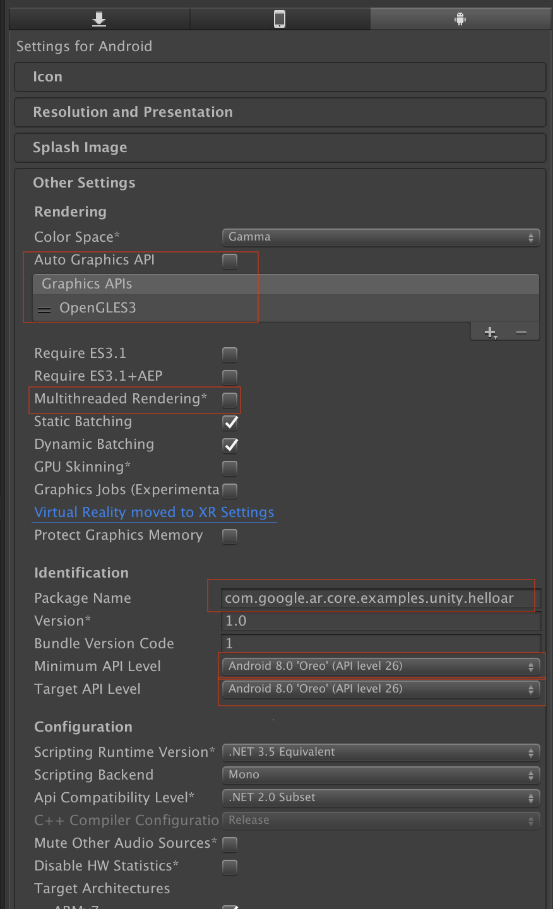
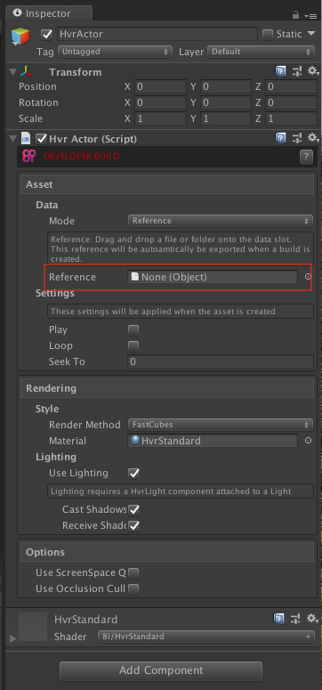

ARCore Integration Tutorial
===========================

Prerequisites
-------------
- A walkthrough of `Google ARCore Quickstart, <https://developers.google.com/ar/develop/unity/quickstart-android>`_
- An `ARCore enabled Android device <https://developers.google.com/ar/discover/supported-devices>`_
- Unity 2017.4.9f1 or later with Android Build Support
	- Note Unity 2018.2 has an known bug with Android render target, so it's not supported. See `bug tracking here <https://issuetracker.unity3d.com/issues/android-camera-dot-settargetbuffers-wont-write-depth-to-depth-texture-on-android-devices>`_.
- Android SDK 7.0 (API Level 24) or later
- Accept all the licenses from Android SDK. For example, if you are on macOS:
	- $ cd ~/Library/Android/sdk/tools/bin
	- $ ./sdkmanager --licenses
	- Accept all the licenses.

Getting ARCore SDK for Unity
----------------------------
- Download `ARCore SDK for Unity 1.4.0 or later <https://github.com/google-ar/arcore-unity-sdk/releases>`_
- Open Unity and create a new empty 3D project

- Select Assets > Import Package > Custom Package, use the downloaded arcore-unity-sdk-v1.4.0.unitypackage from your disk. 

- In the import dialogue, make sure everything is selected and click *Import*.

- Accept any API upgrades if prompted.

Importing 8i Unity Plugin
-------------------------
Within the newly created project, extract 8i Unity Plugin into the **Asset** folder, as stated in :ref:`QuickStart` section.

You should have the directory structure like this: 

.. image:: images/android-after-8i-project-structure.png
	:width: 500px

Fix any warning poped up in 8i Project Tips window, including *Android Unpack Scene*.

Configure the Unity Project
---------------------------
- Open scene HelloAR by double clicking Assets/GoogleARCore/Examples/HelloAR/Scenes/HelloAR

- Select File > Build Settings, a build dialogue should come up. click *Player Settings...* button. A PlayerSettings inspector should appear. In the Inspector window, find Other Settings - *Metal Editor Support* and unchecked it. This is important for Unity previewing 8i's hologram content.

.. image:: images/android-build-settings-other-settings-metal-editor.png
	:width: 500px

- Still in Build Settings dialogue, in *Platform* choose Android and click *Switch Platform* button. Make sure the *Platform* is switched to Android, and make sure HelloAR scene is ticked on by using *Add Open Scenes*.

- Still in Build Settings dialogue, click *Player Settings...* button. A PlayerSettings inspector should appear. In the Inspector window, a few fields need to be configured:
	- Other Settings - Package Name: set to an reversed DNS like name, e.g. com.yourcompany.arsample
	- Other Settings - Uncheck Auto Graphics API and explicitly set OpenGL ES 3 as the graphics API
	- Other Settings - Multithreaded Rendering: uncheck
	- Other Settings - Minimal API Level: set to Android 7.0 or higher. Note you need to have the right version of Android SDK installed and configured in Unity > Preference.
	- Other Settings - Target API Level: set to Android 7.0 or higher. Note you need to have the right version of Android SDK installed and configured in Unity > Preference.
	- XR Settings - ARCore Supported: tick on

Your First 8i Hologram
----------------------
For this introduction, we'll just reuse the *HelloAR* scene from Google ARCore SDK for Unity's example. With the HelloAR scene opened,

- Select menu GameObject > 8i > HvrActor. This will create an GameObject with proper HvrActor component attached to it.

- Select the newly created *HvrActor* object, the Inspector panel should show something like this:

There are a few options to note but for now we will just focus on the Asset/Data/Reference field.

This is the data source that 8i's hologram engine will read from. As you can see, right now it's empty. To specify a valid file reference, we can go to folder 8i/examples/assets/hvr, and find "president" folder:

- Drag this "president" folder to Asset/Data/Reference field in Inspector panel. To make things even simpler, we uncheck the Rendering/Lighting/Use Lighting checkbox:

.. image:: images/inspector-hvractor-president.png
	:width: 500px

You should be able to see the hologram has already been shown in the Scene view:

Making A Prefab
---------------
Because we want our user be able to drop the hologram whenever he touches the ground, we need to wrap this HvrActor object into a so called "prefab", which is an `important idea in Unity <https://docs.unity3d.com/Manual/Prefabs.html>`_, and let the HelloAR code know. To do so:

Make sure HvrActor is currently selected. Drag HvrActor object down to a folder in the Project window, Unity will automatically create a prefab for you, and you will see the name of HvrActor turns blue:

To change the HelloAR scene to spawn *HvrActor* instead of Andy Android, find *Example Controller* object in the scene and select it.
Drag the newly created prefab *HvrActor* to *Example Controller*'s Inspector panel, replace *Andy Plane Prefab* and *Andy Point Prefab* with *HvrActor*:

Now it's safe to delete the HvrActor in the scene as we already have one prefab on the disk. Go to Hierarchy and right click on HvrActor, which should has its name in blue colour, and choose "Delete".

Save the scene by pressing Cmd+S.

Camera Configuration
--------------------
But that's not about it! Without proper configured camera, you can only view the hologram in Unity Editor. In order to let the camera render 8i's hologram, we need a component attached to the camera object. Here's how to do it.

Find the camera object in Hierarchy > ARCore Device > First Person Camera and select it.

With *First Person Camera* seleced, In menu choose Component > 8i > HvrRender, this should add a *HvrRender* component to the camera:

.. image:: images/android-attach-hvrrender.png
	:width: 500px

Save the scene by pressing Cmd+S.

Include .hvr/.hvrs Data
-----------------------
Before we can export the project, there's an extra step to do. Because we are using a *prefab* which means it will be dynamically loaded. We need to explicitly tell Unity to include the data before exporting.

- First, right click on the Project window and create an asset of type HvrDataReference. You do it through Create > 8i > HvrDataReference.

- After creation, select the asset. Drag the president folder to its data field.

- Now we have created and configured the asset on disk. Now we need to include this asset in our scene. Right click in Hierarchy window and create an empty GameObject.

- With the empty object selected, attach a component of type HvrDataBuildInclude. You can find it in Component > 8i > HvrDataBuildInclude.

- Drag the configured HvrDataReference asset to Data Reference field.

- Finally, choose from menu 8i > Android > Prepare Build and click OK if a dialogue prompts. This will prepare and bake the content ready to be submit to Android device. Note this is an Android specific process whenever you changed the dynamic loaded 8i content. You don't have to do it if no 8i content changed between builds.

- Save the scene by Cmd+S.

Export and Build
----------------
That's it! Simple as. It's time to export an APK and deploy it to the device.

- Connect your Android phone to your development machine
- `Enable developer options and USB debugging <https://developer.android.com/studio/debug/dev-options.html#enable>`_ on your Android phone. This should be done just once.
- Menu File > Build Settings, click *Player Settings*.
- Click *Build And Run*, select a folder to export the APK. If everything went smooth, you should be to see the APK get exported and automatically deployed to device.

.. image:: images/android-build-and-run.png
	:width: 500px

- Once the build is up and running, pick up your phone and walk around until a magenta ground is shown, which means you can put your holograms on.
- Tap the white grid ground or blue dots to see how hologram works within AR world.

Where to go from now on
-----------------------
- Check out our documentation on all the :ref:`Components` and how they interact with each other.
- Take a look at Google `Augmented Reality Design Guidelines <https://designguidelines.withgoogle.com/ar-design/augmented-reality-design-guidelines/introduction-to-ar-arcore.html>`_.
- Download 8i holograms from `https://8i.com/developers/downloads/ <https://8i.com/developers/downloads/>`_.
