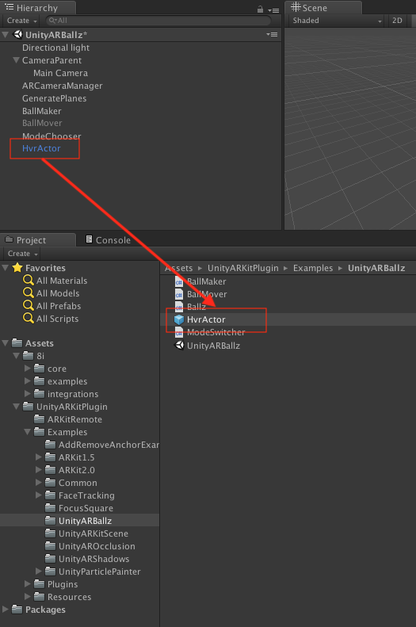

ARKit Integration Tutorial
==========================

Prerequisites
-------------
- iOS devices that support ARKit and Metal and run *iOS 11.3* or later, see `here, <https://developer.apple.com/library/archive/documentation/DeviceInformation/Reference/iOSDeviceCompatibility/DeviceCompatibilityMatrix/DeviceCompatibilityMatrix.html>`_
	- If you want to run ARKit 2.0, you need an iOS 12 device.
- Mac installed latest macOS,
- *Unity 2017.1* or later,
- *Xcode 9.3* or later, with command line tools installed, see `here. <http://osxdaily.com/2014/02/12/install-command-line-tools-mac-os-x/>`_
	- If you want to run ARKit 2.0, you need Xcode 10 or later.
- Do some reading at `https://developer.apple.com/documentation/arkit/understanding_augmented_reality <https://developer.apple.com/documentation/arkit/understanding_augmented_reality>`_ and get a high level idea of how AR works on iOS.

Getting Unity ARKit plugin
--------------------------
- Go to `https://bitbucket.org/Unity-Technologies/unity-arkit-plugin <https://bitbucket.org/Unity-Technologies/unity-arkit-plugin>`_ and download the official Unity ARKit plugin. You might need to install Mercurial or SourceTree to grab the source.
- Switch to *1.5.1* tag if you want it to run on iOS 11 devices. Here's how you do it in SourceTree but could be different if you use other Mercurial client:

- Within the downloaded project, extract 8i Unity Plugin into the **Asset** folder, as stated in :ref:`Installation` section.
- You should have the directory structure like that: 

.. image:: images/unity-arkit-plugin-with-8i.png
	:width: 500px

Configure the Unity Project
---------------------------
- Open the project in Unity. If you are prompt with if project needs to be upgrade to the current Unity version, then click Yes.
- If a 8i Project Tips warning pops up, click *Ignore All* for now.

- Select File > Build Settings, a build dialogue should come up. In *Platform* choose iOS and click *Switch Platform* button. Make sure the *Platform* is switched to iOS, and choose one of the scene as into the build. In this tutorial, we checked the simplest scene *UnityARBallz*.

- Still in Build Settings dialogue, click *Player Settings...* button. A PlayerSettings inspector should appear. In the Inspector window, find *Metal Editor Support* and unchecked it. Also make sure Metal is listed as the first in *Graphics APIs*. This is because 8i Unity Plugin doesn't work with Metal on macOS at the moment but iOS need it.

Your First 8i Hologram
----------------------
For introduction, we'll just reuse the *UnityARBallZ* scene from Unity ARKit plugin's example. In this example, we will change the original AR ball to 8i's hologram, so that you can touch the detected plane on the phone and place a human hologram onto the augmented world. 

- To open the scene, find the scene in project and double click the scene.

- You should be able to see something like this in Scene view:

Seems pretty empty? That's because this is a barebone template of an AR app and all it does is to automatically detect the environment and track the movement of the device and tie it to the virtual *Camera* object. Everything 'seen' by the Camera will be additively blended to the real world image. So what we are going to do now, is to change the instantiate prefab from a ball mesh object, to an 8i *HvrActor* object.

- Select menu GameObject > 8i > HvrActor, it will create an GameObject with proper HvrActor component attached to it.

- Select the newly created *HvrActor* object, the Inspector panel should show something like this:

.. image:: images/inspector-hvractor.png
	:width: 500px

- There are a few options to note but for now we will just focus on the Asset/Data/Reference field. This is the data source that 8i's hologram engine will read from. As you can see, right now it's empty. To specify a valid file reference, we can go to folder 8i/examples/assets/hvr, and find "president" folder:

.. image:: images/where-is-president.png
	:width: 500px

- Drag this "president" folder to Asset/Data/Reference field in Inspector panel. To make things even simpler, we uncheck the Rendering/Lighting/Use Lighting checkbox:

.. image:: images/inspector-hvractor-president.png
	:width: 500px

You should be able to see the hologram has already been shown in the Scene view:

Making A Prefab
---------------
Because we want our user be able to drop the hologram whenever he touches the ground, we need to wrap this HvrActor object into a so called "prefab", which is an `important idea in Unity <https://docs.unity3d.com/Manual/Prefabs.html>`_, and let our ARKit code know. To do so:

- Make sure HvrActor is currently selected. Drag HvrActor object down to a folder in the Project window, Unity will automatically create a prefab for you, and you will see the name of HvrActor turns blue:

- To change the ARKit code to spawn *HvrActor*s instead of balls, find *BallMaker* object in the scene and select it.
- Drag the newly created prefab *HvrActor8 to *BallMaker*'s Inspector panel, replace *BallPrefab* with *HvrActor*:

- Now it's save to delete the HvrActor in the scene as we already have one prefab on the disk. Go to Hierarchy and right click on HvrActor, which should has its name in blue colour, and choose "Delete".

- Save the scene by pressing Cmd+S.

Camera Configuration
--------------------
But that's not about it! Without proper configured camera, you can only view the hologram in Unity Editor. In order to let the camera render 8i's hologram, we need a component attached to the camera object. Here's how to do it.

- Find the camera object in Hierarchy > CameraParent > Main Camera and select it.

- With *Main Camera* seleced, In menu choose Component > 8i > HvrRender, this should add a *HvrRender* component to the camera:

- Save the scene by pressing Cmd+S.

Export and Build
----------------
That's it! Simple as. It's time to export Xcode projectand deploy it to the device.

- Menu File > Build Settings, click *Player Settings* and make sure Metal is the first listed in the Inspector window.
- Click Build, select a folder to export the project. If everything went smooth, a Finder window should pop up and shows the exported Xcode project.
- Double click *Unity-iPhone.xcodeproj* and this should bring up Xcode.
- Configure Xcode project as follows. You need to pay attention to code signing `if you are new to it <https://help.apple.com/xcode/mac/current/#/dev60b6fbbc7>`_. After configuration, hit run:

- Once the build is deployed and running, pick up your phone and walk around until a magenta ground is shown, which means you can put your holograms on. Tap the magenta ground to see how hologram works within AR world.

Where to go from now on
-----------------------
- Check out our documentation on all the :ref:`Components` and how they interact with each other.
- Try out :ref:`Examples` in both 8i plugin and Unity ARKit plugin.
- Take a look at Apple HIG on AR: `https://developer.apple.com/design/human-interface-guidelines/ios/system-capabilities/augmented-reality/ <https://developer.apple.com/design/human-interface-guidelines/ios/system-capabilities/augmented-reality/>`_.
- Download 8i holograms from `https://8i.com/developers/downloads/ <https://8i.com/developers/downloads/>`_.
