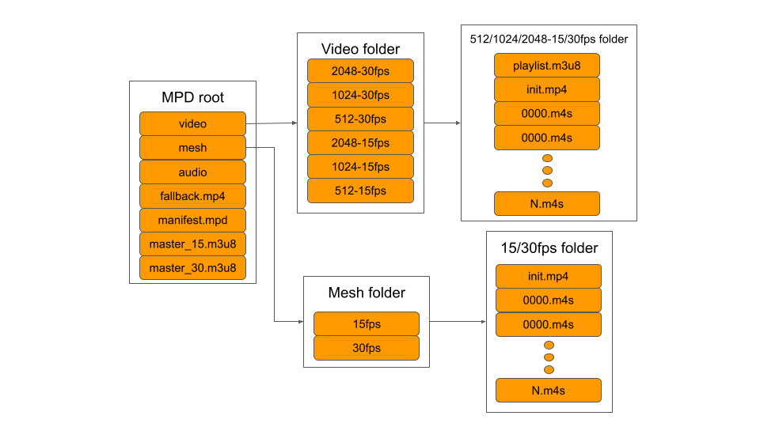

MPD structure
============================================================

**Description of files and folders**

* video - Folder that contains all texture data
* mesh - Folder that contains all mesh data
* manifest.mpd - MPEG-DASH manifest file describing the video/audio/mesh representation available for this asset
* fallback.mp4 - video and audio mp4 that is used if the platform does not support MPEG-DASH or HLS
* master_15.m3u8 - Manifest file for HLS streaming for 15 FPS variant of the asset
* master_30.m3u8 - Manifest file for HLS streaming for the 30 FPS variant of the asset
* init.mp4 - the init segment of the chunked video data
* *.m4s - chunks of the video data
* playlist.m3u8 - per representation HLS file describing the init file and chunks
